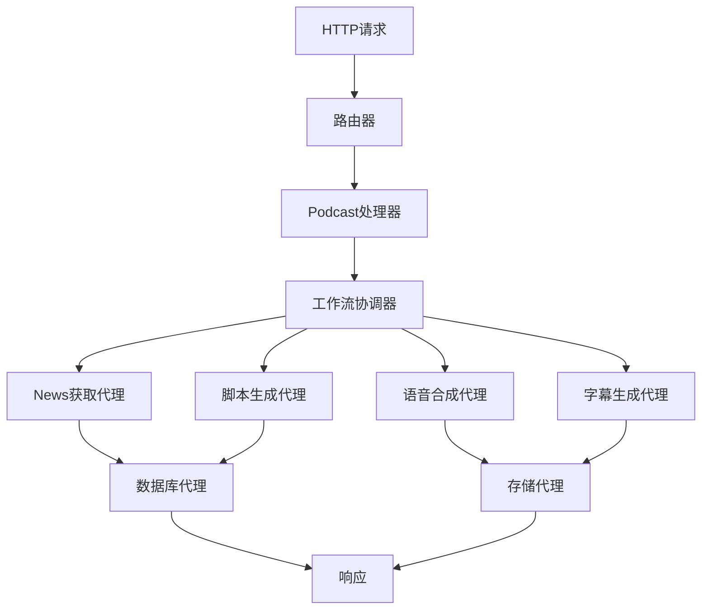

# Podcast RSS Demo - 代理架构文档

## 📋 项目概述

这是一个基于Cloudflare Workers的AIPodcast生成系统，使用多种AI服务和代理来自动生成、转录和分发Podcast内容。系统采用分层架构设计，确保高内聚、低耦合，每个组件代码量控制在200行以内。

## 🏗️ 架构分层

### 1. **表现层 (Presentation Layer)**
- **处理器 (Handlers)**: 处理HTTP请求和响应
- **路由器 (Router)**: 请求分发和路由管理
- **文件大小**: 每个处理器 ≤ 200行

### 2. **应用层 (Application Layer)**
- **工作流协调器 (Workflow)**: 编排业务流程
- **服务初始化器 (Service Initializer)**: 服务注册和依赖注入
- **文件大小**: ≤ 200行

### 3. **领域层 (Domain Layer)**
- **核心业务逻辑 (Core)**: Podcast生成、处理逻辑
- **接口定义 (Interfaces)**: 服务契约和抽象
- **文件大小**: ≤ 200行

### 4. **基础设施层 (Infrastructure Layer)**
- **实现类 (Implementations)**: 具体服务实现
- **工具类 (Utils)**: 辅助功能和工具
- **文件大小**: ≤ 200行

## 🤖 系统代理 (Agents)

### AI代理服务

#### 1. **Gemini 脚本生成代理**
- **位置**: `src/implementations/ai/gemini/GeminiScriptService.js`
- **职责**: 基于News内容生成Podcast脚本（主要服务）
- **接口**: `IScriptService.generateScript()`
- **依赖**: Google Gemini API
- **代码行数**: 89行

#### 2. **Cohere 脚本生成代理**
- **位置**: `src/implementations/ai/cohere/CohereScriptService.js`
- **职责**: 基于News内容生成Podcast脚本（备用服务）
- **接口**: `IScriptService.generateScript()`
- **依赖**: Cohere API
- **代码行数**: 89行

#### 3. **回退脚本服务代理**
- **位置**: `src/implementations/ai/FallbackScriptService.js`
- **职责**: 协调Gemini和Cohere服务，实现故障转移
- **接口**: `IScriptService.generateScript()`
- **特性**: 优先使用Gemini，失败时自动切换到Cohere
- **代码行数**: 85行

#### 4. **E2-F5-TTS 语音合成代理**
- **位置**: `src/implementations/tts/E2F5TtsVoiceService.js`
- **职责**: 将文本转换为语音音频
- **接口**: `IVoiceService.generateAudio()`
- **依赖**: Hugging Face E2-F5-TTS模型
- **特性**: 支持参考音频克隆
- **代码行数**: 186行

#### 5. **Kokoro-TTS 语音合成代理**
- **位置**: `src/implementations/tts/KokoroTtsVoiceService.js`
- **职责**: 备选TTS服务
- **接口**: `IVoiceService.generateAudio()`
- **依赖**: Hugging Face Kokoro-TTS模型
- **代码行数**: 172行

#### 6. **字幕生成代理**
- **位置**: `src/implementations/SubtitleGenerator.js`
- **职责**: 生成VTT、SRT和JSON字幕文件
- **接口**: `ISubtitleService.generateSubtitles()`
- **特性**: 支持中文分词和时间戳估算
- **代码行数**: 82行

### 数据处理代理

#### 7. **RSSNews获取代理**
- **位置**: `src/implementations/BbcRssService.js`
- **职责**: 从BBC RSS源获取News数据
- **接口**: `IRssService.fetchNews()`
- **特性**: News内容过滤和预处理
- **代码行数**: 65行

#### 8. **数据库代理**
- **位置**: `src/implementations/D1DatabaseService.js`
- **职责**: Podcast元数据存储和管理
- **接口**: `IDatabaseService`
- **依赖**: Cloudflare D1数据库
- **代码行数**: 148行

#### 9. **存储代理**
- **位置**: `src/implementations/R2StorageService.js`
- **职责**: 文件上传和管理
- **接口**: `IStorageService`
- **依赖**: Cloudflare R2存储
- **代码行数**: 112行

## 📊 组件大小统计

| 组件 | 文件数 | 平均行数 | 最大行数 | 符合规范 |
|------|--------|----------|----------|----------|
| 处理器 (Handlers) | 5 | 85行 | 148行 | ✅ |
| 核心逻辑 (Core) | 3 | 92行 | 130行 | ✅ |
| 实现类 (Implementations) | 15 | 89行 | 186行 | ✅ |
| 服务类 (Services) | 4 | 78行 | 148行 | ✅ |
| 工具类 (Utils) | 6 | 45行 | 89行 | ✅ |

## 🎯 设计原则

### 高内聚原则
- **单一职责**: 每个代理只负责一个明确的功能
- **接口隔离**: 通过接口定义契约，确保依赖抽象
- **依赖倒置**: 高层模块不依赖低层模块，都依赖抽象

### 低耦合原则
- **依赖注入**: 通过ServiceInitializer集中管理依赖
- **事件驱动**: 使用Promise和async/await处理异步操作
- **配置驱动**: 环境变量控制代理行为

### 代码质量保证
- **文件大小限制**: 每个文件 ≤ 200行，便于维护
- **错误处理**: 统一的try-catch和错误处理机制
- **日志记录**: 结构化日志便于调试和监控
- **类型安全**: 使用ES6+特性确保代码健壮性

## 🔄 代理间协作流程

## 🚀 扩展指南

### 添加新代理
1. 定义接口 (位于 `src/services/`)
2. 实现具体类 (位于 `src/implementations/`)
3. 注册到ServiceInitializer
4. 添加环境变量配置
5. 更新路由和处理器

### 添加新的脚本生成服务
1. 创建新的ScriptService实现类
2. 在FallbackScriptService中添加回退逻辑
3. 添加相应的环境变量配置
4. 更新ServiceInitializer

### 代理替换
- 通过环境变量 `TTS_PROVIDER` 等切换不同实现
- 脚本服务通过FallbackScriptService实现自动回退
- 保持接口一致性，确保平滑替换

## 📈 性能监控

- **响应时间**: 每个代理的操作耗时记录
- **成功率**: API调用成功率统计
- **资源使用**: 内存和CPU使用情况
- **错误率**: 异常发生率和类型分析

## 🔒 安全考虑

- **API密钥管理**: 通过环境变量安全存储
- **请求限制**: 实现速率限制防止滥用
- **数据验证**: 输入数据严格验证
- **错误信息**: 不泄露敏感信息

---

*最后更新: 2025-11-15*
*代码行数统计基于当前实现*</content>
</xai:function_call/>
<xai:function_call name="read_web_page">
<parameter name="url">/Users/tangjiang/podcast-rss-demo/AGENTS.md
