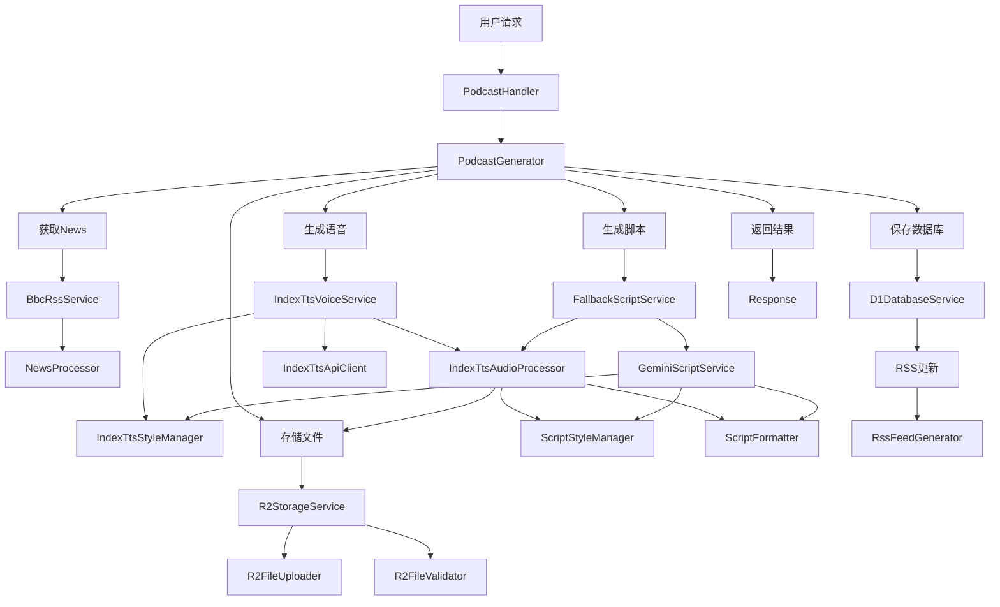
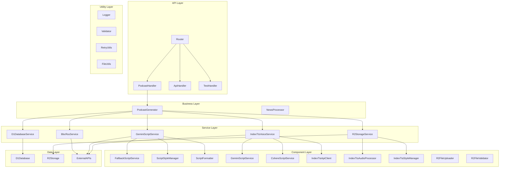
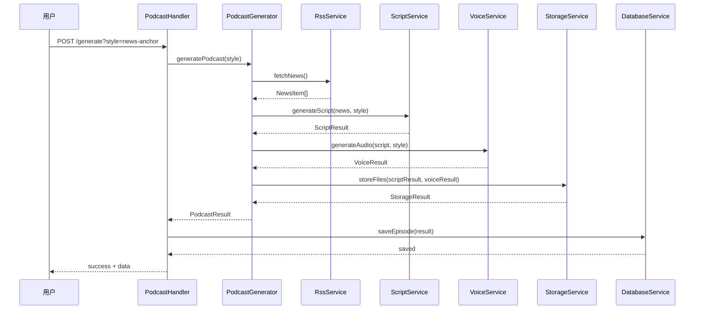

# 🏗️ 系统架构设计

## 🎯 架构原则

### 高内聚低耦合
- 每个模块职责单一，功能内聚
- 模块间通过接口通信，降低耦合
- 支持独立测试和替换

### 组合优于继承
- 使用组合模式组织复杂功能
- 小组件易于测试和维护
- 灵活的配置和扩展

### 单一职责原则
- 每个类只负责一个明确的功能
- 方法长度控制在合理范围内
- 清晰的命名和文档

## 📦 架构分层

```
┌─────────────────┐
│   API Layer     │  ← HTTP请求处理，路由分发
├─────────────────┤
│ Business Layer  │  ← 业务逻辑编排，数据转换
├─────────────────┤
│ Service Layer   │  ← 外部服务集成，数据访问
├─────────────────┤
│  Data Layer     │  ← 数据存储，缓存管理
├─────────────────┤
│ Utility Layer   │  ← 工具函数，基础设施
└─────────────────┘
```

## 🔄 核心业务流程图



## 🏛️ 组件架构图



## 📁 项目结构详解

```
src/
├── core/                          # 核心业务逻辑
│   ├── PodcastGenerator.js        # 主控制器，编排整个生成流程
│   └── NewsProcessor.js           # News处理和过滤逻辑
│
├── implementations/               # 服务具体实现
│   ├── ai/                        # AI脚本生成服务
│   │   ├── gemini/                 # Gemini AI服务
│   │   │   ├── GeminiScriptService.js # Gemini脚本生成
│   │   │   └── GeminiApiClient.js     # Gemini API客户端
│   │   ├── cohere/                 # Cohere AI服务
│   │   │   ├── CohereScriptService.js # Cohere脚本生成
│   │   │   └── CohereApiClient.js     # Cohere API客户端
│   │   ├── FallbackScriptService.js # AI服务回退
│   │   ├── ScriptStyleManager.js    # 脚本风格配置
│   │   └── ScriptFormatter.js       # 脚本格式化和清理
│   ├── BbcRssService.js           # BBC RSSNews获取
│   ├── IndexTtsVoiceService.js    # IndexTTS语音合成
│   ├── IndexTtsApiClient.js       # IndexTTS API客户端
│   ├── IndexTtsAudioProcessor.js  # 音频处理
│   ├── IndexTtsStyleManager.js    # 语音风格配置
│   ├── R2StorageService.js        # R2文件存储
│   ├── R2FileUploader.js          # R2文件上传
│   ├── R2FileValidator.js         # R2文件验证
│   └── D1DatabaseService.js       # D1数据库操作
│
├── services/                      # 接口定义
│   ├── IVoiceService.js           # 语音服务接口
│   ├── IScriptService.js          # 脚本服务接口
│   └── IRssService.js             # RSS服务接口
│
├── handlers/                      # HTTP请求处理器
│   ├── Router.js                  # 路由分发
│   ├── PodcastHandler.js          # Podcast生成处理器
│   ├── ApiHandler.js              # 通用API处理器
│   ├── FeedApiHandler.js          # RSS Feed处理器
│   ├── EpisodeApiHandler.js       # 剧集管理处理器
│   ├── SystemApiHandler.js        # 系统状态处理器
│   └── TestHandler.js             # 测试功能处理器
│
├── repositories/                  # 数据访问层
│   ├── EpisodeRepository.js       # 剧集数据访问
│   └── StatisticsRepository.js    # 统计数据访问
│
├── utils/                         # 工具函数
│   ├── logger.js                  # 日志工具
│   ├── validator.js               # 数据验证
│   ├── retryUtils.js              # 重试机制
│   └── fileUtils.js               # 文件处理
│
└── types/                         # 类型定义
    └── index.js                   # TypeScript风格类型定义
```

## 🔄 数据流图



## 🎨 设计模式应用

### 1. 策略模式 (Strategy Pattern)
- **ScriptStyleManager**: 根据不同风格选择不同的提示词策略
- **IndexTtsStyleManager**: 根据风格配置不同的语音参数

### 2. 组合模式 (Composite Pattern)
- **PodcastGenerator**: 组合多个服务完成复杂业务流程
- **R2StorageService**: 组合上传器和验证器

### 3. 工厂模式 (Factory Pattern)
- **ServiceInitializer**: 创建和管理所有服务实例
- **Router**: 根据路由规则创建处理器实例

### 4. 模板方法模式 (Template Method)
- **PodcastGenerator.generatePodcast()**: 定义生成流程的模板
- 子步骤通过依赖注入实现多态

### 5. 装饰器模式 (Decorator Pattern)
- **withRetry**: 为任何异步操作添加重试能力
- **Logger**: 为方法调用添加日志记录

## 🔧 错误处理架构

### 分层错误处理
```
┌─────────────────┐
│  API Layer      │ ← HTTP错误码转换
├─────────────────┤
│ Business Layer  │ ← 业务异常处理
├─────────────────┤
│ Service Layer   │ ← 服务集成错误
├─────────────────┤
│ Component Layer │ ← 组件内部错误
├─────────────────┤
│ Utility Layer   │ ← 基础设施错误
└─────────────────┘
```

### 错误类型分类
- **NetworkError**: 网络连接问题
- **ApiError**: 外部API调用失败
- **ValidationError**: 数据验证失败
- **StorageError**: 存储操作失败
- **BusinessError**: 业务逻辑错误

### 重试策略
- **指数退避**: 网络错误重试
- **固定间隔**: API限流重试
- **无重试**: 业务逻辑错误

## 📊 性能优化

### 1. 异步处理
- TTS生成异步处理，避免长时间阻塞
- SSE流式监听，实时状态更新
- 并行文件上传，提高吞吐量

### 2. 缓存策略
- CDN缓存静态资源（1年）
- 浏览器缓存API响应（5分钟）
- 内存缓存配置数据

### 3. 资源管理
- 连接池复用
- 超时控制
- 内存使用监控

## 🔒 安全架构

### 输入验证
- 参数类型检查
- 内容长度限制
- XSS防护

### 访问控制
- API密钥认证
- 请求频率限制
- CORS配置

### 数据保护
- HTTPS传输
- 敏感信息加密
- 日志脱敏

## 📈 可扩展性设计

### 水平扩展
- 无状态设计，支持多实例部署
- 外部服务解耦，支持服务替换
- 配置驱动，支持环境差异

### 垂直扩展
- 组件化设计，支持功能模块扩展
- 接口抽象，支持新实现接入
- 插件架构，支持第三方集成

### 配置管理
- 环境变量配置
- 功能开关控制
- 动态配置更新
