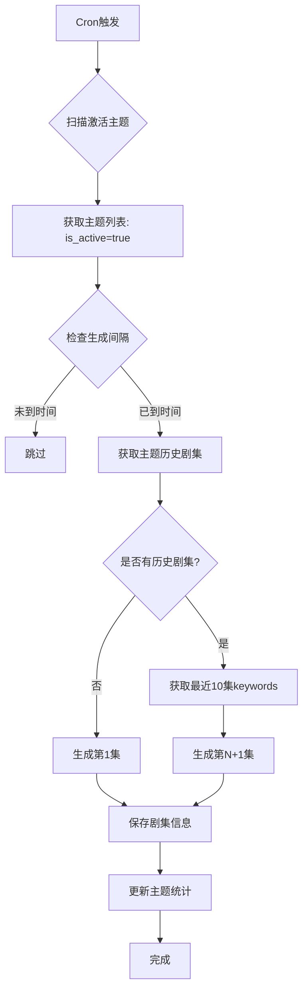

# 主题系列播客生成计划

## 📋 项目需求分析

### 核心需求
用户希望实现一个**主题系列播客自动生成系统**，具备以下特点：

1. **主题管理**：在 D1 数据库中创建主题表，存储主题信息（如"雅思考试策略"）
2. **激活控制**：通过布尔字段控制主题是否被激活
3. **自动扫描**：定时任务扫描激活的主题，检查是否需要生成新剧集
4. **系列延续**：
   - 如果主题是第一次生成，创建第一集
   - 如果已有剧集，延续创作（第2集、第3集...）
   - 提示词包含最近10集的keywords和已有集数，避免内容重复
5. **完整记录**：`topic_podcasts` 表存储每集的完整信息（keywords、abstract、脚本、音频等）

---

## 🔍 当前架构分析

### ✅ 已完成部分

**数据表**（本地已存在）:
- ✅ `topics` 表 - 主题信息表
  ```sql
  - id (INTEGER PRIMARY KEY)
  - title (TEXT) - 主题标题
  - description (TEXT) - 主题描述
  - keywords (TEXT) - 主题关键词
  - category (TEXT) - 分类
  - status (TEXT) - 状态 ('active'/'inactive')
  - created_at, updated_at
  ```

- ✅ `topic_podcasts` 表 - 主题播客剧集表
  ```sql
  - id (INTEGER PRIMARY KEY)
  - topic_id (INTEGER REFERENCES topics)
  - episode_id (TEXT UNIQUE) - 剧集唯一标识
  - status (TEXT) - 生成状态
  - audio_url (TEXT) - 音频链接
  - duration (INTEGER) - 时长
  - created_at, updated_at
  - tts_event_id (TEXT) - 异步TTS任务ID
  ```

**代码实现**:
- ✅ `TopicPodcastService` - 主题播客业务服务
- ✅ `TopicRepository` - 主题数据访问
- ✅ `TopicPodcastRepository` - 主题播客数据访问
- ✅ `CronHandler` - 定时任务处理器

### ❌ 缺失或多余的部分

**数据表字段**:
- ❌ `topics` 表缺少：
  - `is_active` (BOOLEAN) - 激活状态（当前使用 `status` TEXT）
  - `last_generated_at` (TEXT) - 最后生成时间

**数据表字段**:
- ❌ `topics` 表多余：
  - keywords (TEXT) - 关键词
  - category (TEXT) - 分类


- ❌ `topic_podcasts` 表缺少：
  - `episode_number` (INTEGER) - 剧集编号（第1集、第2集...）
  - `title` (TEXT) - 剧集标题
  - `keywords` (TEXT) - **本集使用的关键词**
  - `abstract` (TEXT) - **本集摘要/简介**
  - `script_url` (TEXT) - 脚本文件链接

**业务逻辑**:
- ❌ **系列延续机制**：检查主题已有剧集数量，生成下一集
- ❌ **智能提示词生成**：基于最近10集的keywords和集数构建提示词
- ❌ **去重机制**：确保新剧集不重复讨论已有内容
- ❌ **自动激活扫描**：Cron任务扫描 `is_active=true` 的主题

---

## 📐 完整设计方案

### 1. 数据库架构优化

#### 1.1 Topics 表增强

**新增字段**（保持向后兼容）:
```sql
ALTER TABLE topics ADD COLUMN is_active BOOLEAN DEFAULT 1;
ALTER TABLE topics ADD COLUMN episode_count INTEGER DEFAULT 0;
ALTER TABLE topics ADD COLUMN last_generated_at TEXT;
ALTER TABLE topics ADD COLUMN generation_interval_hours INTEGER DEFAULT 24;
```

**字段说明**:
- `is_active`: 主题是否激活（1=激活, 0=未激活）
- `episode_count`: 当前已生成的剧集数量（自动更新）
- `last_generated_at`: 最后一次生成剧集的时间
- `generation_interval_hours`: 生成间隔（小时），默认24小时

#### 1.2 Topic_Podcasts 表增强

**新增字段**:
```sql
ALTER TABLE topic_podcasts ADD COLUMN episode_number INTEGER NOT NULL DEFAULT 1;
ALTER TABLE topic_podcasts ADD COLUMN title TEXT;
ALTER TABLE topic_podcasts ADD COLUMN keywords TEXT;
ALTER TABLE topic_podcasts ADD COLUMN abstract TEXT;
ALTER TABLE topic_podcasts ADD COLUMN script_url TEXT;
ALTER TABLE topic_podcasts ADD COLUMN srt_url TEXT;
ALTER TABLE topic_podcasts ADD COLUMN vtt_url TEXT;
ALTER TABLE topic_podcasts ADD COLUMN json_url TEXT;

-- 添加唯一约束：每个主题的剧集编号唯一
CREATE UNIQUE INDEX idx_topic_episode_number ON topic_podcasts(topic_id, episode_number);
```

**字段说明**:
- `episode_number`: 剧集编号（第1集、第2集...）
- `title`: 剧集标题（如"雅思口语Part 1 策略"）
- `keywords`: **本集使用的关键词**（逗号分隔）
- `abstract`: 本集摘要/简介
- `script_url`: 脚本文件R2链接
- `srt_url`, `vtt_url`, `json_url`: 字幕文件链接

---

### 2. 系列延续机制设计

#### 2.1 生成流程图



#### 2.2 智能提示词生成策略

**第1集提示词**（无历史）:
```javascript
const prompt = `
你是一位专业的播客主持人，正在制作关于"${topic.title}"的系列播客。

主题信息：
- 标题：${topic.title}
- 描述：${topic.description}
- 目标关键词：${topic.keywords}
- 分类：${topic.category}

任务要求：
这是本系列的第1集，请设计一个引人入胜的开篇内容。

输出要求：
1. 剧集标题：简洁有力，吸引听众
2. 关键词：3-5个本集重点讨论的关键词（从目标关键词中选择）
3. 摘要：100-150字的内容简介
4. 播客脚本：500-800字的口语化内容

请以JSON格式返回：
{
  "title": "剧集标题",
  "keywords": ["keyword1", "keyword2", "keyword3"],
  "abstract": "内容摘要",
  "script": "完整播客脚本"
}
`;
```

**第N+1集提示词**（有历史）:
```javascript
const recentEpisodes = await getRecentEpisodes(topicId, 10); // 最近10集

const usedKeywords = recentEpisodes
  .map(ep => ep.keywords)
  .join(', ');

const episodeHistory = recentEpisodes
  .map(ep => `第${ep.episode_number}集: ${ep.title} (关键词: ${ep.keywords})`)
  .join('\n');

const prompt = `
你是一位专业的播客主持人，正在制作关于"${topic.title}"的系列播客。

主题信息：
- 标题：${topic.title}
- 描述：${topic.description}
- 目标关键词：${topic.keywords}
- 分类：${topic.category}
- 当前进度：已制作${topic.episode_count}集

已制作剧集回顾（最近10集）：
${episodeHistory}

已使用的关键词（避免重复）：
${usedKeywords}

任务要求：
这是本系列的第${topic.episode_count + 1}集，请设计一个承接前面内容、深入探讨新话题的剧集。

重要提示：
- 避免重复讨论已使用的关键词：${usedKeywords}
- 从目标关键词中选择未使用的内容进行深入讲解
- 保持系列的连贯性和递进性

输出要求：
1. 剧集标题：简洁有力，体现本集重点
2. 关键词：3-5个本集重点讨论的**新关键词**（避免与已使用重复）
3. 摘要：100-150字的内容简介
4. 播客脚本：500-800字的口语化内容

请以JSON格式返回：
{
  "title": "剧集标题",
  "keywords": ["keyword1", "keyword2", "keyword3"],
  "abstract": "内容摘要",
  "script": "完整播客脚本"
}
`;
```

---

### 3. 业务逻辑实现

#### 3.1 TopicSeriesGenerator（新增核心服务）

**文件**: `src/core/TopicSeriesGenerator.js`

```javascript
import { Logger } from '../utils/logger.js';

/**
 * 主题系列播客生成器
 * 负责系列延续逻辑、提示词构建、去重机制
 */
export class TopicSeriesGenerator {
  constructor(topicRepository, topicPodcastRepository, scriptService) {
    this.topicRepository = topicRepository;
    this.topicPodcastRepository = topicPodcastRepository;
    this.scriptService = scriptService;
    this.logger = new Logger('TopicSeriesGenerator');
  }

  /**
   * 为主题生成下一集播客
   * @param {number} topicId - 主题ID
   * @returns {Promise<Object>} 生成的剧集信息
   */
  async generateNextEpisode(topicId) {
    // 1. 获取主题信息
    const topic = await this.topicRepository.getTopic(topicId);
    if (!topic) {
      throw new Error(`Topic not found: ${topicId}`);
    }

    // 2. 检查是否需要生成（根据时间间隔）
    if (!this._shouldGenerate(topic)) {
      this.logger.info('Topic generation skipped due to interval', {
        topicId,
        lastGeneratedAt: topic.last_generated_at,
        intervalHours: topic.generation_interval_hours
      });
      return null;
    }

    // 3. 获取历史剧集（最近10集）
    const recentEpisodes = await this.topicPodcastRepository.getRecentEpisodes(
      topicId,
      10
    );

    // 4. 计算下一集编号
    const nextEpisodeNumber = (topic.episode_count || 0) + 1;

    // 5. 构建智能提示词
    const prompt = this._buildPrompt(topic, recentEpisodes, nextEpisodeNumber);

    // 6. 调用AI生成剧集内容
    const episodeContent = await this._generateEpisodeContent(prompt, topic);

    // 7. 返回剧集信息
    return {
      episodeNumber: nextEpisodeNumber,
      title: episodeContent.title,
      keywords: episodeContent.keywords.join(', '),
      abstract: episodeContent.abstract,
      script: episodeContent.script,
      topicId
    };
  }

  /**
   * 检查是否应该生成新剧集
   * @private
   */
  _shouldGenerate(topic) {
    if (!topic.last_generated_at) {
      return true; // 第一次生成
    }

    const intervalHours = topic.generation_interval_hours || 24;
    const lastGenerated = new Date(topic.last_generated_at);
    const now = new Date();
    const hoursSinceLastGen = (now - lastGenerated) / (1000 * 60 * 60);

    return hoursSinceLastGen >= intervalHours;
  }

  /**
   * 构建智能提示词
   * @private
   */
  _buildPrompt(topic, recentEpisodes, nextEpisodeNumber) {
    const isFirstEpisode = recentEpisodes.length === 0;

    if (isFirstEpisode) {
      return this._buildFirstEpisodePrompt(topic);
    } else {
      return this._buildContinuationPrompt(topic, recentEpisodes, nextEpisodeNumber);
    }
  }

  /**
   * 构建第1集提示词
   * @private
   */
  _buildFirstEpisodePrompt(topic) {
    return `
你是一位专业的播客主持人，正在制作关于"${topic.title}"的系列播客。

主题信息：
- 标题：${topic.title}
- 描述：${topic.description}
- 目标关键词：${topic.keywords}
- 分类：${topic.category}

任务要求：
这是本系列的第1集，请设计一个引人入胜的开篇内容。

输出要求：
1. 剧集标题：简洁有力，吸引听众
2. 关键词：3-5个本集重点讨论的关键词（从目标关键词中选择）
3. 摘要：100-150字的内容简介
4. 播客脚本：500-800字的口语化内容

请以JSON格式返回：
{
  "title": "剧集标题",
  "keywords": ["keyword1", "keyword2", "keyword3"],
  "abstract": "内容摘要",
  "script": "完整播客脚本"
}
`.trim();
  }

  /**
   * 构建延续集提示词
   * @private
   */
  _buildContinuationPrompt(topic, recentEpisodes, nextEpisodeNumber) {
    const usedKeywords = recentEpisodes
      .map(ep => ep.keywords)
      .filter(k => k)
      .join(', ');

    const episodeHistory = recentEpisodes
      .map(ep => `第${ep.episode_number}集: ${ep.title} (关键词: ${ep.keywords})`)
      .join('\n');

    return `
你是一位专业的播客主持人，正在制作关于"${topic.title}"的系列播客。

主题信息：
- 标题：${topic.title}
- 描述：${topic.description}
- 目标关键词：${topic.keywords}
- 分类：${topic.category}
- 当前进度：已制作${topic.episode_count}集

已制作剧集回顾（最近${recentEpisodes.length}集）：
${episodeHistory}

已使用的关键词（避免重复）：
${usedKeywords}

任务要求：
这是本系列的第${nextEpisodeNumber}集，请设计一个承接前面内容、深入探讨新话题的剧集。

重要提示：
- 避免重复讨论已使用的关键词：${usedKeywords}
- 从目标关键词中选择未使用的内容进行深入讲解
- 保持系列的连贯性和递进性

输出要求：
1. 剧集标题：简洁有力，体现本集重点
2. 关键词：3-5个本集重点讨论的**新关键词**（避免与已使用重复）
3. 摘要：100-150字的内容简介
4. 播客脚本：500-800字的口语化内容

请以JSON格式返回：
{
  "title": "剧集标题",
  "keywords": ["keyword1", "keyword2", "keyword3"],
  "abstract": "内容摘要",
  "script": "完整播客脚本"
}
`.trim();
  }

  /**
   * 调用AI生成剧集内容
   * @private
   */
  async _generateEpisodeContent(prompt, topic) {
    try {
      // 调用脚本生成服务（Gemini/Cohere）
      const result = await this.scriptService.generateScript(
        [{ title: topic.title, description: prompt }],
        'topic-explainer'
      );

      // 解析JSON响应
      const content = this._parseAIResponse(result.content);

      return content;

    } catch (error) {
      this.logger.error('AI episode generation failed', error);
      throw new Error(`Failed to generate episode content: ${error.message}`);
    }
  }

  /**
   * 解析AI响应（处理JSON）
   * @private
   */
  _parseAIResponse(responseText) {
    try {
      // 尝试提取JSON（可能包含在代码块中）
      const jsonMatch = responseText.match(/```json\s*([\s\S]*?)\s*```/) ||
                       responseText.match(/\{[\s\S]*\}/);

      if (!jsonMatch) {
        throw new Error('No JSON found in AI response');
      }

      const jsonText = jsonMatch[1] || jsonMatch[0];
      const parsed = JSON.parse(jsonText);

      // 验证必需字段
      if (!parsed.title || !parsed.keywords || !parsed.abstract || !parsed.script) {
        throw new Error('Missing required fields in AI response');
      }

      return {
        title: parsed.title,
        keywords: Array.isArray(parsed.keywords) ? parsed.keywords : parsed.keywords.split(','),
        abstract: parsed.abstract,
        script: parsed.script
      };

    } catch (error) {
      this.logger.error('Failed to parse AI response', { responseText, error });

      // 降级方案：使用原始文本作为脚本
      return {
        title: `Episode Content`,
        keywords: [],
        abstract: responseText.substring(0, 150),
        script: responseText
      };
    }
  }
}
```

#### 3.2 TopicRepository 增强

**新增方法**:
```javascript
/**
 * 获取所有激活的主题（需要生成播客的）
 * @returns {Promise<Topic[]>} 激活的主题列表
 */
async getActiveTopics() {
  const result = await this.db.prepare(`
    SELECT * FROM topics 
    WHERE is_active = 1
    ORDER BY last_generated_at ASC NULLS FIRST
  `).all();

  return result.results;
}

/**
 * 更新主题统计信息
 * @param {number} topicId - 主题ID
 * @param {Object} updates - 更新数据
 */
async updateTopicStats(topicId, updates) {
  const { episodeCount, lastGeneratedAt } = updates;

  await this.db.prepare(`
    UPDATE topics 
    SET episode_count = ?,
        last_generated_at = ?,
        updated_at = datetime('now')
    WHERE id = ?
  `).bind(episodeCount, lastGeneratedAt, topicId).run();
}
```

#### 3.3 TopicPodcastRepository 增强

**新增方法**:
```javascript
/**
 * 获取主题的最近N集剧集
 * @param {number} topicId - 主题ID
 * @param {number} limit - 限制数量
 * @returns {Promise<Episode[]>} 剧集列表
 */
async getRecentEpisodes(topicId, limit = 10) {
  const result = await this.db.prepare(`
    SELECT * FROM topic_podcasts
    WHERE topic_id = ? AND status = 'completed'
    ORDER BY episode_number DESC
    LIMIT ?
  `).bind(topicId, limit).all();

  return result.results.reverse(); // 返回正序（第1集到第10集）
}

/**
 * 创建主题播客剧集（增强版）
 * @param {Object} episodeData - 剧集数据
 */
async createEpisode(episodeData) {
  const {
    topicId,
    episodeId,
    episodeNumber,
    title,
    keywords,
    abstract,
    scriptUrl,
    audioUrl,
    srtUrl,
    vttUrl,
    jsonUrl,
    duration,
    status = 'completed',
    ttsEventId
  } = episodeData;

  await this.db.prepare(`
    INSERT INTO topic_podcasts (
      topic_id, episode_id, episode_number, title, keywords, abstract,
      script_url, audio_url, srt_url, vtt_url, json_url,
      duration, status, tts_event_id,
      created_at, updated_at
    ) VALUES (?, ?, ?, ?, ?, ?, ?, ?, ?, ?, ?, ?, ?, ?, datetime('now'), datetime('now'))
  `).bind(
    topicId, episodeId, episodeNumber, title, keywords, abstract,
    scriptUrl, audioUrl, srtUrl, vttUrl, jsonUrl,
    duration, status, ttsEventId
  ).run();

  return episodeId;
}
```

#### 3.4 CronHandler 增强

**新增逻辑**:
```javascript
/**
 * 执行定时任务 - 扫描激活主题并生成播客
 */
async _executeScheduledTasks(event, services) {
  const results = [];

  try {
    // 1. 获取所有激活的主题
    const activeTopics = await services.topicRepository.getActiveTopics();

    this.logger.info(`Found ${activeTopics.length} active topics`, {
      topics: activeTopics.map(t => ({ id: t.id, title: t.title }))
    });

    // 2. 为每个主题生成下一集
    for (const topic of activeTopics) {
      try {
        const result = await this._generateTopicSeriesEpisode(services, topic);
        results.push(result);
      } catch (error) {
        this.logger.error(`Failed to generate episode for topic ${topic.id}`, error);
        results.push({
          task: 'topic-series-episode',
          topicId: topic.id,
          topicTitle: topic.title,
          status: 'failed',
          error: error.message
        });
      }
    }

    // 3. 如果没有激活主题，生成新闻播客
    if (activeTopics.length === 0) {
      results.push(await this._generateDailyNewsPodcast(services));
    }

    return {
      success: true,
      cron: event.cron,
      tasks: results,
      executedAt: new Date().toISOString()
    };

  } catch (error) {
    this.logger.error('Scheduled tasks execution failed', error);
    throw error;
  }
}

/**
 * 为主题生成系列剧集
 */
async _generateTopicSeriesEpisode(services, topic) {
  this.logger.info('Generating series episode for topic', {
    topicId: topic.id,
    topicTitle: topic.title,
    currentEpisodeCount: topic.episode_count
  });

  try {
    // 使用 TopicSeriesGenerator 生成下一集
    const seriesGenerator = new TopicSeriesGenerator(
      services.topicRepository,
      services.topicPodcastRepository,
      services.scriptService
    );

    const episodeInfo = await seriesGenerator.generateNextEpisode(topic.id);

    if (!episodeInfo) {
      return {
        task: 'topic-series-episode',
        topicId: topic.id,
        status: 'skipped',
        reason: 'Generation interval not reached'
      };
    }

    // 调用 TopicPodcastService 完成完整的播客生成
    const result = await services.topicPodcastService.generatePodcastWithContent({
      topicId: topic.id,
      episodeNumber: episodeInfo.episodeNumber,
      title: episodeInfo.title,
      keywords: episodeInfo.keywords,
      abstract: episodeInfo.abstract,
      script: episodeInfo.script,
      style: 'topic-explainer'
    });

    // 更新主题统计
    await services.topicRepository.updateTopicStats(topic.id, {
      episodeCount: episodeInfo.episodeNumber,
      lastGeneratedAt: new Date().toISOString()
    });

    return {
      task: 'topic-series-episode',
      topicId: topic.id,
      topicTitle: topic.title,
      episodeNumber: episodeInfo.episodeNumber,
      episodeId: result.episodeId,
      status: 'completed',
      duration: result.duration
    };

  } catch (error) {
    this.logger.error('Topic series episode generation failed', error);
    throw error;
  }
}
```

---

### 4. 实施步骤

#### 阶段 1: 数据库迁移（1小时）

**任务**:
1. 创建迁移脚本 `migrations/0004_enhance_topics_for_series.sql`
2. 创建迁移脚本 `migrations/0005_enhance_topic_podcasts_for_series.sql`
3. 本地测试迁移
4. 生产环境迁移

**迁移脚本**:

`migrations/0004_enhance_topics_for_series.sql`:
```sql
-- 为 topics 表添加系列生成相关字段

ALTER TABLE topics ADD COLUMN is_active BOOLEAN DEFAULT 1;
ALTER TABLE topics ADD COLUMN episode_count INTEGER DEFAULT 0;
ALTER TABLE topics ADD COLUMN last_generated_at TEXT;
ALTER TABLE topics ADD COLUMN generation_interval_hours INTEGER DEFAULT 24;

-- 创建索引
CREATE INDEX IF NOT EXISTS idx_topics_is_active ON topics(is_active);
CREATE INDEX IF NOT EXISTS idx_topics_last_generated ON topics(last_generated_at);

-- 更新现有记录：将 status='active' 的主题设置为激活
UPDATE topics SET is_active = CASE WHEN status = 'active' THEN 1 ELSE 0 END;

-- 记录迁移
INSERT INTO _migration_metadata (version, description, applied_at) VALUES (
  4,
  'Enhance topics table for series generation support',
  datetime('now')
);
```

`migrations/0005_enhance_topic_podcasts_for_series.sql`:
```sql
-- 为 topic_podcasts 表添加完整剧集信息字段

ALTER TABLE topic_podcasts ADD COLUMN episode_number INTEGER DEFAULT 1;
ALTER TABLE topic_podcasts ADD COLUMN title TEXT;
ALTER TABLE topic_podcasts ADD COLUMN keywords TEXT;
ALTER TABLE topic_podcasts ADD COLUMN abstract TEXT;
ALTER TABLE topic_podcasts ADD COLUMN script_url TEXT;
ALTER TABLE topic_podcasts ADD COLUMN srt_url TEXT;
ALTER TABLE topic_podcasts ADD COLUMN vtt_url TEXT;
ALTER TABLE topic_podcasts ADD COLUMN json_url TEXT;

-- 为现有记录分配剧集编号
UPDATE topic_podcasts 
SET episode_number = (
  SELECT COUNT(*) 
  FROM topic_podcasts AS tp2 
  WHERE tp2.topic_id = topic_podcasts.topic_id 
    AND tp2.id <= topic_podcasts.id
);

-- 创建唯一约束
CREATE UNIQUE INDEX idx_topic_episode_number ON topic_podcasts(topic_id, episode_number);

-- 记录迁移
INSERT INTO _migration_metadata (version, description, applied_at) VALUES (
  5,
  'Enhance topic_podcasts table with full episode information',
  datetime('now')
);
```

#### 阶段 2: 核心服务实现（2小时）

**任务**:
1. 创建 `TopicSeriesGenerator.js`
2. 增强 `TopicRepository.js`（新增方法）
3. 增强 `TopicPodcastRepository.js`（新增方法）
4. 修改 `TopicPodcastService.js`（支持系列生成）

#### 阶段 3: Cron任务集成（1小时）

**任务**:
1. 修改 `CronHandler.js`（添加主题扫描逻辑）
2. 更新 `ServiceInitializer.js`（注册新服务）
3. 测试定时任务触发

#### 阶段 4: 测试与验证（1小时）

**任务**:
1. 创建测试主题数据
2. 手动触发生成第1集
3. 验证系列延续（第2集、第3集）
4. 检查关键词去重效果
5. 验证定时任务自动生成

---

### 5. 使用示例

#### 5.1 创建主题

```bash
# 通过API创建主题
curl -X POST "https://podcast-rss-demo.tj15982183241.workers.dev/api/topics" \
  -H "Content-Type: application/json" \
  -d '{
    "title": "雅思考试策略",
    "description": "全面解析雅思考试的各个部分，提供实用的备考策略和技巧",
    "keywords": "雅思口语,雅思写作,雅思听力,雅思阅读,考试技巧,评分标准,备考计划,时间管理,词汇积累,语法提升",
    "category": "education",
    "is_active": true,
    "generation_interval_hours": 24
  }'
```

#### 5.2 手动生成第1集

```bash
curl -X POST "https://podcast-rss-demo.tj15982183241.workers.dev/api/topics/1/generate"
```

**预期输出**:
```json
{
  "success": true,
  "episodeId": "topic-1-ep-1-1732012800000",
  "topicId": 1,
  "episodeNumber": 1,
  "title": "雅思考试全面解析：从入门到精通",
  "keywords": "雅思口语, 评分标准, 备考计划",
  "abstract": "本集播客将为您全面介绍雅思考试的结构、评分标准以及如何制定高效的备考计划...",
  "duration": 180,
  "status": "completed"
}
```

#### 5.3 等待定时任务生成第2集

**Cron触发后** (24小时后):
- 系统自动扫描激活主题
- 检测到"雅思考试策略"已有1集
- 获取第1集的keywords: "雅思口语, 评分标准, 备考计划"
- 生成第2集，使用新的keywords（如"雅思写作, 词汇积累"）

#### 5.4 查询系列剧集

```bash
curl "https://podcast-rss-demo.tj15982183241.workers.dev/api/topics/1/episodes"
```

**预期输出**:
```json
{
  "success": true,
  "topic": {
    "id": 1,
    "title": "雅思考试策略",
    "episode_count": 5
  },
  "episodes": [
    {
      "episode_number": 1,
      "title": "雅思考试全面解析：从入门到精通",
      "keywords": "雅思口语, 评分标准, 备考计划",
      "duration": 180,
      "created_at": "2025-11-19T10:00:00Z"
    },
    {
      "episode_number": 2,
      "title": "雅思写作高分秘籍：结构与词汇",
      "keywords": "雅思写作, 词汇积累, 语法提升",
      "duration": 195,
      "created_at": "2025-11-20T10:00:00Z"
    }
    // ...
  ]
}
```

---

### 6. 关键技术点

#### 6.1 关键词去重算法

```javascript
/**
 * 从目标关键词中选择未使用的关键词
 */
function selectUnusedKeywords(targetKeywords, usedKeywords, count = 3) {
  const targetSet = new Set(targetKeywords.split(',').map(k => k.trim()));
  const usedSet = new Set(usedKeywords.split(',').map(k => k.trim()));

  const unused = [...targetSet].filter(k => !usedSet.has(k));

  return unused.slice(0, count);
}
```

#### 6.2 生成间隔控制

```javascript
/**
 * 检查是否应该生成新剧集
 */
function shouldGenerate(topic) {
  if (!topic.last_generated_at) {
    return true; // 第一次生成
  }

  const intervalHours = topic.generation_interval_hours || 24;
  const lastGenerated = new Date(topic.last_generated_at);
  const now = new Date();
  const hoursSinceLastGen = (now - lastGenerated) / (1000 * 60 * 60);

  return hoursSinceLastGen >= intervalHours;
}
```

#### 6.3 剧集编号自动递增

```sql
-- 获取下一个剧集编号
SELECT COALESCE(MAX(episode_number), 0) + 1 AS next_episode_number
FROM topic_podcasts
WHERE topic_id = ?
```

---

### 7. API接口设计

#### 7.1 主题管理API

```javascript
// POST /api/topics - 创建主题
// GET /api/topics - 查询主题列表
// GET /api/topics/:id - 查询主题详情
// PUT /api/topics/:id - 更新主题
// DELETE /api/topics/:id - 删除主题
```

#### 7.2 剧集管理API

```javascript
// POST /api/topics/:id/generate - 手动生成下一集
// GET /api/topics/:id/episodes - 查询主题的所有剧集
// GET /api/topics/:id/episodes/:episodeNumber - 查询特定剧集
```

#### 7.3 系统API

```javascript
// GET /api/system/active-topics - 查询激活的主题
// POST /api/system/trigger-cron - 手动触发定时任务（测试用）
```

---

### 8. 风险与注意事项

#### 8.1 AI生成质量风险

**风险**: AI可能生成重复内容或偏离主题

**缓解措施**:
1. 提示词中明确列出已使用的关键词
2. 添加人工审核机制（status='draft' → 'published'）
3. 实现内容相似度检测

#### 8.2 成本控制

**风险**: 频繁调用AI和TTS服务导致成本过高

**缓解措施**:
1. 设置合理的生成间隔（默认24小时）
2. 限制激活主题数量
3. 监控API调用次数

#### 8.3 数据一致性

**风险**: 并发生成导致剧集编号冲突

**缓解措施**:
1. 使用数据库唯一约束 `UNIQUE(topic_id, episode_number)`
2. 事务处理确保原子性
3. 添加分布式锁（如果需要）

---

### 9. 后续优化方向

1. **智能主题推荐**: 基于用户反馈推荐新主题
2. **动态关键词库**: 根据热门话题自动扩展关键词
3. **多语言支持**: 支持英文、中文等多种语言
4. **用户订阅**: 允许用户订阅特定主题的播客
5. **内容质量评分**: 基于用户反馈优化提示词

---

## 📊 实施时间表

| 阶段 | 任务 | 预计时间 | 负责人 |
|------|------|---------|--------|
| 1 | 数据库迁移 | 1小时 | 开发 |
| 2 | 核心服务实现 | 2小时 | 开发 |
| 3 | Cron任务集成 | 1小时 | 开发 |
| 4 | 测试与验证 | 1小时 | 测试 |
| **总计** | | **5小时** | |

---

## ✅ 验收标准

1. ✅ 数据库表包含所有必需字段
2. ✅ 可以创建和激活主题
3. ✅ 第1集生成成功，包含完整信息（title, keywords, abstract, script）
4. ✅ 第2集生成时能检测到第1集的keywords并避免重复
5. ✅ 定时任务能自动扫描激活主题并生成新剧集
6. ✅ 剧集编号自动递增且唯一
7. ✅ API接口返回正确的系列信息

---

## 🎯 最终效果

完成后，系统将实现：

1. **自动化**: 定时任务自动扫描激活主题，无需人工干预
2. **智能化**: AI根据历史剧集智能生成新内容，避免重复
3. **系列化**: 每个主题形成连贯的播客系列，剧集间有递进关系
4. **可扩展**: 支持无限主题和剧集，灵活配置生成间隔
5. **完整性**: 每集包含完整的元数据（keywords, abstract, script, audio）

---

**请审阅此计划，如有任何疑问或需要调整的地方，请告知。审阅通过后我将开始实施。**
